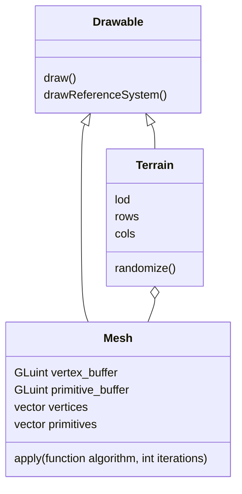

# Terrain interpolation proof of concept

This is a proof of concept for terrain interpolation. The documentation is written in French, but most of the comments are in English, so here goes nothing.

## Installation

Set up the dependencies mentioned below, _i.e._ `OpenGL`, `GLFW`, `Glm`, and `Glu`. A bash script is available for Debian/Ubuntu-based systems at `scripts/deps_setup_debian.sh`.

Build the project with `cmake` and `make`:

```bash
cd terrain_interpolation
mkdir build
cd build
cmake ..
make
```

Run the program:

```bash
./src/main
```

## Project Report - Terrain Interpolation

### Introduction

This project aims to procedurally generate terrain from a very low-resolution point mesh, by implementing various surface subdivision models. The technologies used are:

- [OpenGL](https://www.khronos.org/opengl/)
- [Glfw](https://www.glfw.org/)
- [Glm](https://glm.g-truc.net/)
- [Glu](https://en.wikipedia.org/wiki/OpenGL_Utility_Library)

The entire implementation is done in C++. The source code is available on [Github](https://www.github.com/mlucifer27/opengl-terrain-gen).

### Architecture

For obvious reasons of code readability, the project is organized into several files/classes, whose roles are described below.



The file `main.cpp` contains the main project code. It creates an object of type `Terrain` and displays it. Window management is handled by the GLFW library, and rendering is performed with OpenGL. The user can move the camera and zoom into the terrain at any time using the arrow keys (rotation) and <kbd>Z</kbd> or <kbd>S</kbd> (zoom).

The `lod` (level of detail) is a parameter that determines the terrain resolution. The higher the level of detail, the smoother the terrain. It is an integer defining the number of surface subdivision iterations to perform. The <kbd>+</kbd> and <kbd>-</kbd> keys allow you to increase or decrease it.

The subdivision algorithms used are very modular and can easily be swapped. They are described in the file `algorithms.hpp`. For this project, our goal was to implement the `Loop` surface subdivision algorithm. However, due to time constraints, we opted for a simplified version: we create three new vertices per triangle, along with their associated primitives, then we “blur” the terrain by averaging the coordinates of neighboring vertices.

The results obtained are as follows:

| Applied Algorithm      | Result                                                        |
| ---------------------- | ------------------------------------------------------------- |
| none                   | very angular terrain, low resolution                          |
| naive subdivision      | very angular terrain, but high resolution                     |
| subdivision + blurring | terrain smoothed by the “blurring” pass of vertex coordinates |

### Implementation

Terrain randomly generated (white noise) with a resolution of 10x10. The terrain appears in white, with vertex normals shown in red.


Same terrain, with face coloring. As seen here, without prior interpolation, this model is unusable.


Terrain smoothed through the blurring pass of vertex coordinates.


Terrain obtained by the same method as before, with added high-frequency white noise (simulating ground irregularities).


Same terrain, but colored based on each vertex’s normal and height.


Terrain smoothed by an improved version of the vertex attribute averaging algorithm, with lighting.


### Conclusion

We can see that the terrain obtained is very smooth and fairly close to what we might encounter in reality. Many improvements are possible, such as simulating erosion or generating more precise textures and normals. However, for the purposes of this project, we will be content with this simple proof of feasibility.
