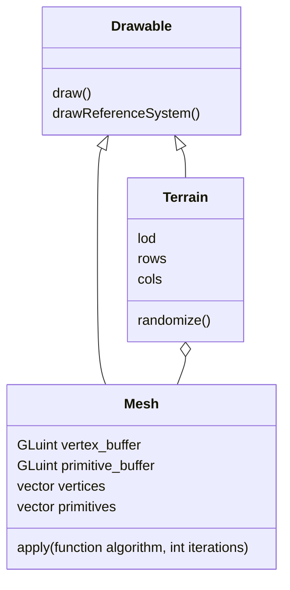
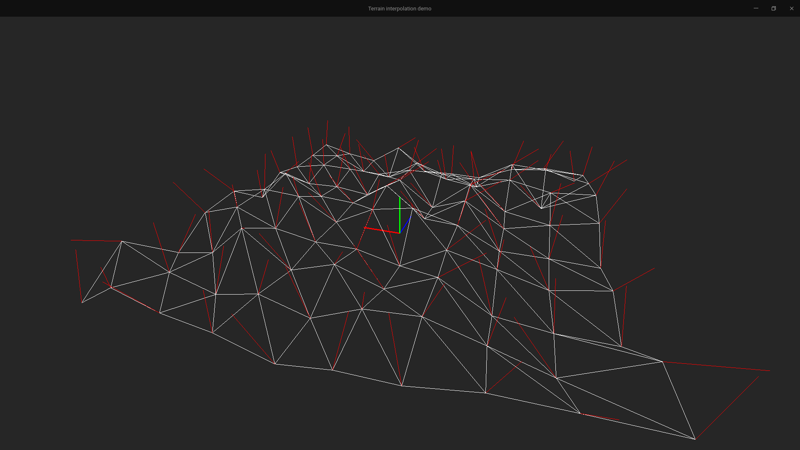
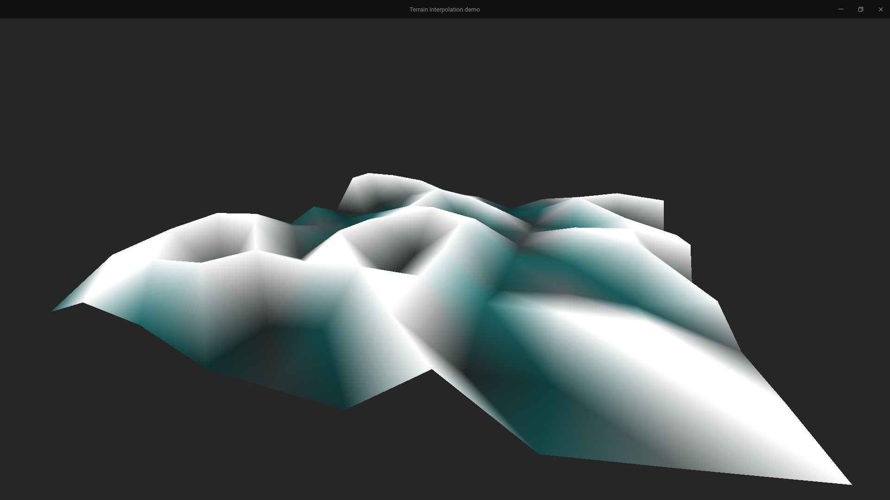
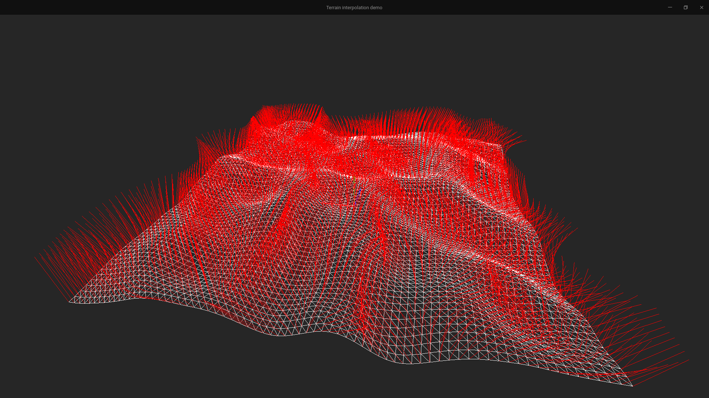
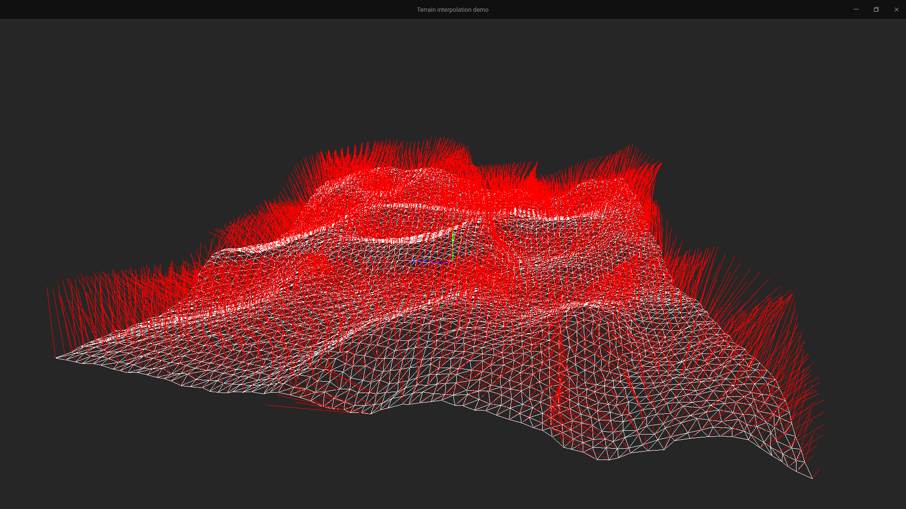
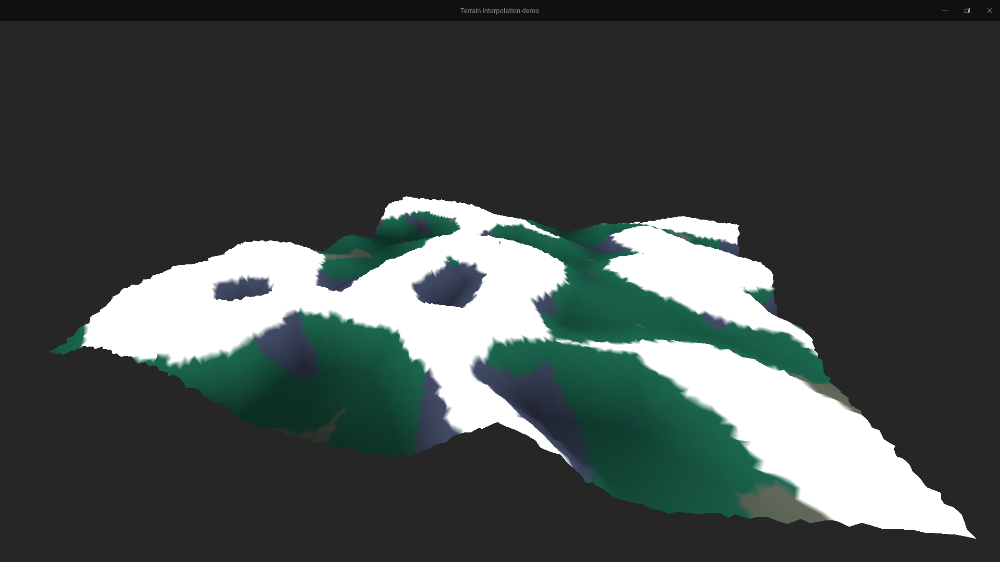

# Terrain interpolation proof of concept

This is a proof of concept for terrain interpolation. The documentation is written in french, but most of the comments are in english, so here goes nothing.

## Installation

Setup the dependencies mentionned below, *ie* `OpenGL`, `GLFW`, `Glm`, and `Glu`. A bash script is available for debian/ubuntu-based systems at `scripts/deps_setup_debian.sh`.

Build the project with `cmake` and `make`:

```bash
cd terrain_interpolation
mkdir build
cd build
cmake ..
make
```

Run the program:

```bash
./src/main
```


## Rapport de projet - Interpolation de terrain
### Introduction
Ce projet se donne pour but de générer procéduralement un terrain à partir d'un maillage de points de très faible résolution, en mettant en oeuvre divers modèles de subdivision de surface. Les technologies utilisées sont :
- [OpenGL](https://www.khronos.org/opengl/)
- [Glfw](https://www.glfw.org/)
- [Glm](https://glm.g-truc.net/)
- [Glu](https://en.wikipedia.org/wiki/OpenGL_Utility_Library)

L'intégralité de cette implémentation est réalisée en C++. Le code source est disponible sur [Github](https://www.github.com/bsodium/terrain-interpolation).

### Architecture
Pour des raisons évidentes de lisibilité du code, le projet est organisé en plusieurs fichiers/classes, dont les rôles sont décrits ci-dessous.


Le fichier `main.cpp` contient le code principal du projet. Il crée un objet de type `Terrain` et l'affiche. La gestion de la fenêtre est réalisée par la librairie GLFW, et le rendu est effectué par OpenGL. L'utilisateur peut à tout moment déplacer la caméra et zoomer sur le terrain à l'aide des touches fléchées (rotation) et de <kbd>Z</kbd> ou <kbd>S</kbd> (zoom).  

Le `lod` (level of detail), ou niveau de détail du terrain en français, est un paramètre qui détermine la résolution du terrain. Plus le niveau de détail est élevé, plus le terrain est lisse. Il s'agit d'un entier qui définit le nombre d'itérations de subdivision de surface à effectuer. Les touches <kbd>+</kbd> et <kbd>-</kbd> permettent ainsi de l'augmenter ou de le diminuer.  

Les algorithmes de subdivision utilisés sont très modulaires, et peuvent être aisément interchangés. Ils sont décrits dans le fichier `algorithms.hpp`. Dans le cadre de ce projet, nous nous étions donné pour but d'implémenter l'algorithme de subdivision de surface `Loop`. Cependant, par manque de temps, nous nous sommes rabattu sur une version simplifiée: on crée trois nouveaux sommets par triangle, ainsi que leur primitives associées, puis on "floute" le terrain par moyennage des coordonnées des sommets voisins.
Le résultat obtenu est successivement:
| algorithme appliqué    | résultat                                                             |
| ---------------------- | -------------------------------------------------------------------- |
| aucun                  | terrain très anguleux, de faible résolution                          |
| subdivision naïve      | terrain très anguleux, mais de haute résolution                      |
| subdivision + floutage | terrain lissé par la passe de "floutage" des coordonnées des sommets |

### Réalisation

Terrain généré aléatoirement (bruit blanc) avec une résolution de 10x10. On peut voir en blanc le terrain, en rouge les normales associées aux vertices.


Même terrain, avec coloration des faces. Comme on peut le voir ici, sans interpolation préalable, ce modéle est inutilisable.


Terrain lissé par la passe de floutage des coordonnées des sommets.


Terrain obtenu par la même méthode que précédemment, auquel on a ajouté un bruit blanc de haute fréquence (simule les irrégularités du sol).


Même terrain, mais coloré en fonction de la normale et de la hauteur de chaque sommet.


Terrain lissé par une version améliorée de l'algorithme de moyennage des attributs des sommets, avec éclairage.

### Conclusion
On peut voir que le terrain obtenu est très lisse, est relativement proche de ce que l'on pourrait rencontrer dans la réalité. Bien des améliorations sont envisageables, telles qu'une simulation d'érosion, ou encore une génération de textures/de normales plus précise, cependant dans le cadre de ce projet, nous nous contenterons de cette simple démonstration de faisabilité.
