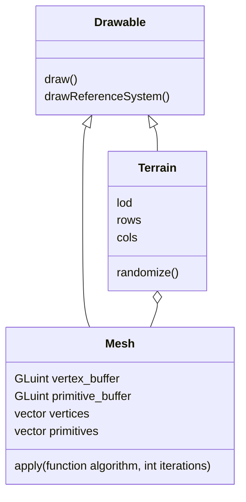

# Project Report - Terrain Interpolation

## Introduction

This project aims to procedurally generate a terrain from a very low-resolution point mesh, by implementing various surface subdivision models. The technologies used are:

- [OpenGL](https://www.khronos.org/opengl/wiki/OpenGL_Home)
- [Glfw](https://www.glfw.org/)
- [Glm](https://glm.g-truc.net/)
- [Glu](https://en.wikipedia.org/wiki/OpenGL_Utility_Library)

The entire implementation is done in C++. The source code is available on [Github](https://www.github.com/mlucifer27/opengl-terrain-gen).

## Architecture

For obvious reasons of code readability, the project is organized into several class files, whose roles are described below.

The file `main.cpp` contains the main project code. It creates an object of type `Terrain` and displays it. Window management is handled by the `glfw` library, and rendering is performed by OpenGL. The user can move the camera and zoom into the terrain at any time using the arrow keys (rotation) and <kbd>Z</kbd> or <kbd>S</kbd> (zoom).  
The `lod` (level of detail) is a parameter that determines the terrain resolution. The higher the level of detail, the smoother the terrain. It’s an integer that defines the number of surface subdivision iterations to perform. The <kbd>+</kbd> and <kbd>-</kbd> keys allow the user to increase or decrease it.  
The subdivision algorithms used are very modular and can be easily swapped. They are described in the file `algorithms.hpp`. For this project, we initially set out to implement the `Loop` surface subdivision algorithm. However, due to lack of time, we fell back on a simplified version: we create three new vertices per triangle along with their associated primitives, then we “blur” the terrain by averaging the coordinates of neighboring vertices.

The results are as follows:
| Applied Algorithm | Result |
| ----------------------- | ------------------------------------------------------------------- |
| none | very angular terrain, low resolution |
| naive subdivision | very angular terrain, but high resolution |
| subdivision + blurring | terrain smoothed by the “blurring” pass of vertex coordinates |

## Implementation

Terrain randomly generated (white noise) with a resolution of 10x10. The terrain appears in white, with vertex normals shown in red.

Same terrain, with face coloring. As shown here, without prior interpolation, this model is unusable.

Terrain smoothed by the blurring pass of vertex coordinates.

Terrain generated by the same method as before, with added high-frequency white noise (simulating ground irregularities).

Same terrain, but colored according to the normal and height of each vertex.

## Conclusion

We can see that the terrain obtained is very smooth and quite close to what we might find in reality. Many improvements are possible, such as erosion simulation, or more precise generation of textures/normal maps. However, within the scope of this project, we will be satisfied with this simple proof of feasibility.
